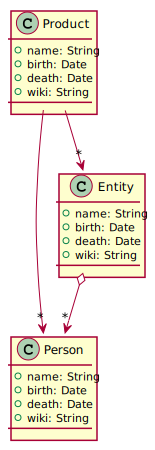

# manager-annalsScience
Universo Santa Tecla  
[uSantaTecla@gmail.com](mailto:uSantaTecla@gmail.com)  
  
## index

* [domainModel](#domainModel)  
    * [vocabulary](#vocabulary)   
* [versions](#versions)
    * [1.0.publicationLanguage](./docs/0.0.dataLanguages.md)
    * [2.0.graphics](./docs/2.0.graphics.md)

## domainModel  

- A lo largo de la historia de la ciencia han surgido grandes **personajes** (filosofos, físicos, matemáticos, ... informáticos). Estas personas, bien por libre de forma autónoma o bajo el auspicio de alguna **entidad** (corte, mecenas, empresa, universidad, ...) han aportado grandes **productos** a la ciencia (teorias, leyes, herramientas, ..., software).
  - Por tanto, existe una relación entre la entidades asociadas a las personas que las integran y relaciones entre las personas y/o entidades asociadas a los productos que los crearon. 
  - Para todos los elementos interesan los siguientes campos:
    - Nombre
    - Fecha de nacimiento, creación, ...
    - Fecha de defunción, utilidad, ...
    - Imagen, retrato, logo, ..., url a la imagen
    - Wiki, url al elemento
    - Para los Productos además interesa:
      - Personas que han participado en su desarrollo
      - Entidades que han participado en su desarrollo
    - Para las Entidades además interesa:
      - Personas que han participado en su desarrollo

