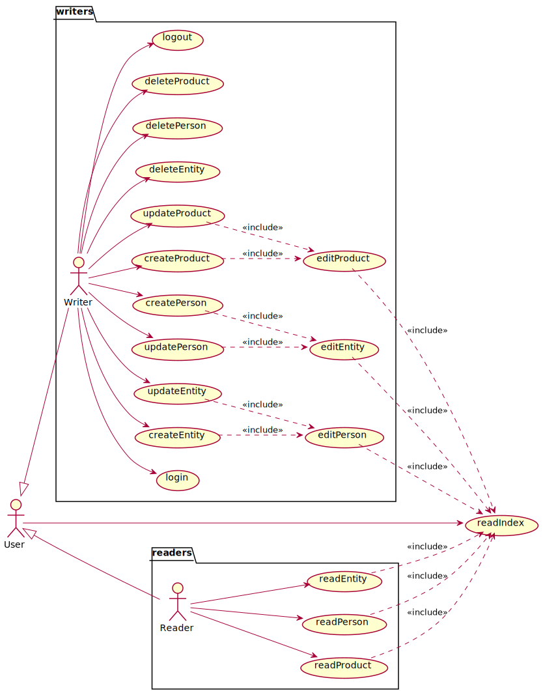
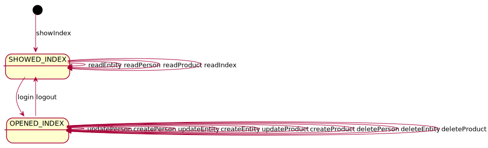

# Anales de la Ciencia
Universo Santa Tecla  
[uSantaTecla@gmail.com](mailto:uSantaTecla@gmail.com)  
  
## index

* [domainModel](#domainModel)  
    * [vocabulary](#vocabulary)  
    * [initialState](#initialState)  
    * [finalState](#finalState)
    * [instructions](#instructions)  
* [versions](#versions)
    * [0.0.dataLanguage](./0.0.dataLanguages/README.md)
    * [0.0.publicationLanguage](./0.0.publicationLanguage/README.md)
    * [1.0.basic](./1.0.basic/README.md)
    * [1.1.machine](./1.1.machine/README.md)
    * [2.0.graphics](./2.0.graphics/README.md)
    * [3.0.undoRedo](./3.0.undoRedo/README.md)
    * [4.0.distributed](./4.0.distributed/README.md)
    * [5.0.files](./5.0.files/README.md)
    * [6.0.bbdd](./6.0.bbdd/README.md)

## domainModel  

- A lo largo de la historia de la ciencia han surgido grandes personajes (filosofos, físicos, matemáticos, ... informáticos). Estas personas, bien por libre de forma autónoma o bajo el auspicio de alguna entidad (corte, mecenas, empresa, universidad, ...) han aportado grandes productos a la ciencia (teorias, leyes, herramientas, ..., software).
 * Por tanto, existe una relación entre la entidades asociadas a las personas que las integran y relaciones entre las personas y/o entidades asociadas a los productos que los crearon. 

- Para todos los elementos interesan los siguientes campos:

 * Nombre
 * Fecha de nacimiento, creación, ...
 * Fecha de defunción, utilidad, ...
 * Imagen, retrato, logo, ..., url a la imagen
 * Wiki, url al elemento
 * Para los Productos interesa:
   * Personas que han participado en su desarrollo
   * Entidades que han participado en su desarrollo
 * Para las Entidades intersa:
   * Personas que han participado en su desarrollo

## Requisitos

### Requisitos Funcionales

#### Actores y Casos de Uso

- Actores y Casos de Uso 

* un *user* puede:
 * _read Index_, leer el índice general, página de arranque

* un *reader*, especialización de usuario, puede:
  * _read Person_
  * _read Entity_
  * _read Product_ 

* un *writer*, especilización de usuario, puede realizar:
  * _login_
  * _create Person_ 
  * _create Entity_
  * _create Product_
  * _update Person_
  * _update Entity_
  * _update Product_ 
  * _delete Person_
  * _delete Entity_
  * _delete Product_
  * _logout_ 

- Diagrama de Casos de Uso

### Contexto del Sistema

- **Diagrama de Estados** del Contexto del Sistema: relación de qué casos de uso se pueden realizar dependiendo de los casos de uso realizados previamente

  * _Por ejemplo: no se puede leer un elemento sin leer el índice; no se puede insertar sin un login previo; ..._

#### Detalles de Casos de Uso

##### Actor _user_

- Casos de Uso
 * **__readIndex__**

- Detalle

* *user* solicita ver el índice, externa o internamente, _url_ o _link_ respectivamente
* *sistema* 
  * muestra la lista del nombre e imagen de todos los elementos separdos por Entidades, Personas y Productos
  * si no está previamente loggeado, _reader_
  * permite solicitar ver el detalle de un elemento
    * permite introducir usuario y contraseña y solicitar login
  * en caso contrario, _writer_
    * permite crear una Persona, Entidad o Producto
    * permite modificar una Persona, Entidad o Producto
    * permite eliminar una Persona, Entidad o Producto
    * permite logout

##### Actor _reader_

-  **__readPerson__**

* *usuario* solicita ver el detalle de una Persona
* *sistema* 
  * muestra nombre, fechas de nacimiento y defunción, si la hay, la imagen, la wiki y los  listados de Productos y Entidades relacionadas con la Persona
  * permite solicitar ver el índice
* Incluye: **__readIndex__** 

- **__readEntity__**

* *usuario* solicita ver el detalle de una Entidad
* *sistema* 
  * muestra nombre, fechas de nacimiento y defunción, si la hay, la imagen, la wiki y los  listados de Personas y Productos relacionadas con la Entidad
  * permite solicitar ver el índice
* Incluye: **__readIndex__**

* **__readProduct__**

* usuario solicita ver el detalle de un Producto
* sistema 
  * muestra nombre, fechas de nacimiento y defunción, si la hay, la imagen, la wiki y los  listados de Personas y Entidades relacionadas con el Producto
  * permite solicitar ver el índice
* Incluye: **__readIndex__**

===== Actor _wirter_

- **__createPerson__**
 
* *writer* solicita crear una Persona
* Incluye: **__editPerson__**

- **__createEntity__**
 
* *writer* solicita crear una Entidad
* Incluye: **__editEntity__**

- **__createProduct__**
 
* *writer* solicita crear un Producto
* Incluye: **__editProduct__**

- **__updatePerson__**
 
* **writer** solicita modificar una Persona
* Incluye: **__editPerson__**

- **__updateEntity__**

* *writer* solicita crear una Entidad
* Incluye: **__editEntity__**

- **__updateProduct__**
 
* **writer** solicita crear un Producto
* Incluye: **__editProduct__**

- **__editPerson__**

* *sistema* permite 
  * modificar el valor del nombre, fechas de nacimiento y defunción y urls de wiki e imagen
  * grabar datos
* *writer* modifica los valores tantas veces como desee y solicita grabar datos
* Incluye: **__readIndex__**, sin solicitud de ver el índice

- **__editEntity__**

* *sistema* permite 
  * modificar el valor del nombre, fechas de nacimiento y defunción y urls de wiki e imagen
  * añadir y eliminar Personas relacionadas con la Entidad
  * grabar los datos
* *writer* 
  * modifica los valores, añade y elimina Personas tantas veces como desee 
  * solicita grabar datos
* Incluye: **__readIndex__**, sin solicitud de ver el índice

- **__editProduct__**

* **sistema** permite 
  * modificar el valor del nombre, fechas de nacimiento y defunción y urls de wiki e imagen
  * añadir y eliminar Personas y Entidades relacionadas con el Producto
  * grabar los datos
* **writer** 
  * modifica los valores, añade y elimina Personas y Entidades tantas veces como desee 
  * solicita grabar datos
* Incluye: **__readIndex__**, sin solicitud de ver el índice

- **__deletePerson__**

* **writer** solicita eliminar una Persona
- Incluye: **__readIndex__**, sin solicitud de ver el índice

- **__deleteEntity__**

* **writer** solicita eliminar una Entidad
* Incluye: **__readIndex__**, sin solicitud de ver el índice

- **__deleteProduct__**
 
* **writer** solicita eliminar un Producto
* Incluye: **__readIndex__**, sin solicitud de ver el índice

#### Prototipo de Interfaz

- SHOWED_INDEX 

- OPENED_INDEX

### Requisitos no funcionales

- **Persistencia**
  * **memoria local** del __front-end__, sin acceso a ningún __back-end__ (__AJAX__), con una carga previa de datos con únicamente tres escritores predefinidos:
    * usuario __x__ con contraseña __x__
    * usuario __y__ con contraseña __y__
    * usuario __z__ con contraseña __z__

- **Interfaz Gráfica de Usuario**
  * **estilo de la vista** (colores, distribución, ...) y resto de pantallas ausentes en el prototipo será diseño del alumno sin necesidad de coincidir con el prototipo dado

- **Implementación** 
  * **Tecnologías Web**: __HTML__, ___CSS___ y __JavaScript__
    * Opcionalmente, se valorará cualquier framework avanzado: __JQuery__, __Bootstrap__, ... propio de las tecnologías Web

