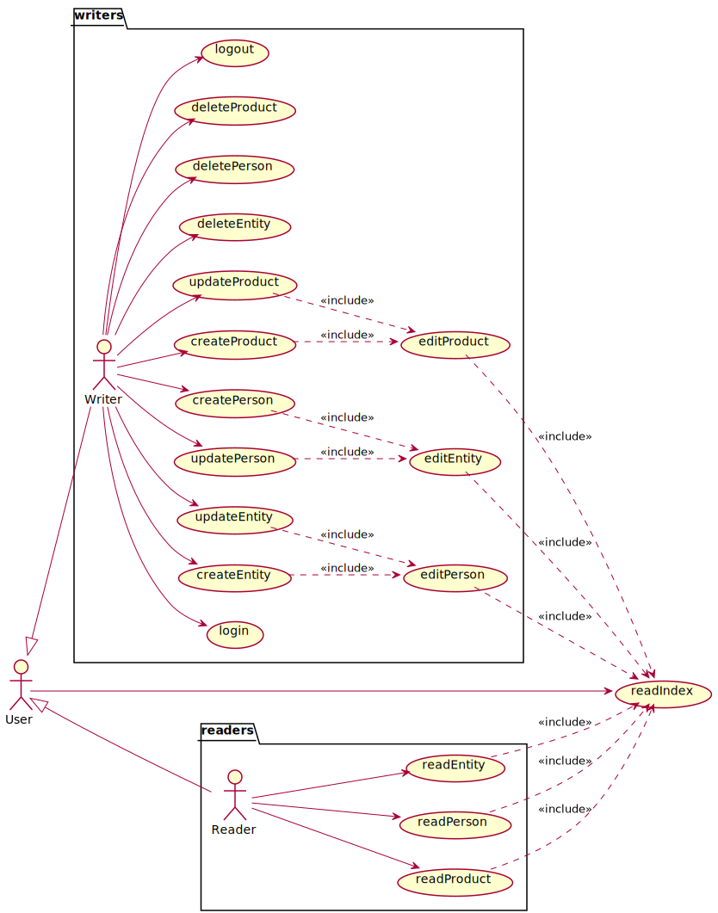

# manager-annalsScience

## 0.0.programmingLanguages

### functionalRequirements

#### UseCases

  - un **user** puede:
    - _read Index_, leer el índice general, página de arranque
  - un **reader**, especialización de usuario, puede:
    - _read Person_
    - _read Entity_
    - _read Product_ 
  - un **writer**, especilización de usuario, puede realizar:
    - _login_
    - _create Person_ 
    - _create Entity_
    - _create Product_
    - _update Person_
    - _update Entity_
    - _update Product_ 
    - _delete Person_
    - _delete Entity_
    - _delete Product_
    - _logout_ 

#### Context

- **Diagrama de Estados** del Contexto de Casos de USo, relaciona qué casos de uso se pueden realizar dependiendo de los casos de uso realizados previamente. __Por ejemplo: no se puede leer un elemento sin leer el índice; no se puede crear un nuevo elemento sin un login previo; ...__

#### UseCaseSpecification

##### userActor

- Casos de Uso: **__readIndex__**
  - **user** solicita ver el índice, externa o internamente, _url_ o _link_ respectivamente
  - **sistema** 
    - muestra la lista del nombre e imagen de todos los elementos separados por Entidades, Personas y Productos
    - si no está previamente loggeado, _reader_
      - permite solicitar ver el detalle de un elemento
      - permite introducir usuario y contraseña y solicitar login
    - en caso contrario, _writer_
      - permite crear una Persona, Entidad o Producto
      - permite modificar una Persona, Entidad o Producto
      - permite eliminar una Persona, Entidad o Producto
      - permite logout

##### readerActor

- Casos de Uso: **__readPerson__**
  - **usuario** solicita ver el detalle de una Persona
  - **sistema** 
    - muestra nombre, fechas de nacimiento y defunción, si la hay, la imagen, la wiki y los listados de Productos y Entidades relacionadas con la Persona
    - permite solicitar ver el índice

- Casos de Uso: **__readEntity__**
  - **usuario** solicita ver el detalle de una Entidad
  - **sistema** 
    - muestra nombre, fechas de nacimiento y defunción, si la hay, la imagen, la wiki y los  listados de Personas y Productos relacionadas con la Entidad
    - permite solicitar ver el índice

- Casos de Uso: **__readProduct__**
  - **usuario** solicita ver el detalle de un Producto
  - **sistema** 
    - muestra nombre, fechas de nacimiento y defunción, si la hay, la imagen, la wiki y los  listados de Personas y Entidades relacionadas con el Producto
    - permite solicitar ver el índice

##### writerActor

- Casos de Uso: **__createPerson__**
  - **writer** solicita crear una Persona
  - Incluye: **__editPerson__**

- Casos de Uso: **__createEntity__**
  - **writer** solicita crear una Entidad
  - Incluye: **__editEntity__**

- Casos de Uso: **__createProduct__**
  - **writer** solicita crear un Producto
  - Incluye: **__editProduct__**

- Casos de Uso: **__updatePerson__**
  - **writer** solicita modificar una Persona
  - Incluye: **__editPerson__**

- Casos de Uso: **__updateEntity__**
  - *writer* solicita crear una Entidad
  - Incluye: **__editEntity__**

- Casos de Uso: **__updateProduct__**
  - **writer** solicita crear un Producto
  - Incluye: **__editProduct__**

- Casos de Uso: **__editPerson__**
  - **sistema** permite 
    - modificar el valor del nombre, fechas de nacimiento y defunción y urls de wiki e imagen
    - grabar datos
  - **writer** modifica los valores tantas veces como desee y solicita grabar datos
  - Incluye: **__readIndex__**, sin solicitud de ver el índice

- Casos de Uso: **__editEntity__**
  - **sistema** permite 
    - modificar el valor del nombre, fechas de nacimiento y defunción y urls de wiki e imagen
    - añadir y eliminar Personas relacionadas con la Entidad
    - grabar los datos
  - **writer** 
    - modifica los valores, añade y elimina Personas tantas veces como desee 
    - solicita grabar datos
  - Incluye: **__readIndex__**, sin solicitud de ver el índice

- Casos de Uso: **__editProduct__**
  - **sistema** permite 
    - modificar el valor del nombre, fechas de nacimiento y defunción y urls de wiki e imagen
    - añadir y eliminar Personas y Entidades relacionadas con el Producto
    - grabar los datos
  - **writer** 
    - modifica los valores, añade y elimina Personas y Entidades tantas veces como desee 
    - solicita grabar datos
    - Incluye: **__readIndex__**, sin solicitud de ver el índice

- Casos de Uso: **__deletePerson__**
  - **writer** solicita eliminar una Persona
  - Incluye: **__readIndex__**, sin solicitud de ver el índice

- Casos de Uso: **__deleteEntity__**
  - **writer** solicita eliminar una Entidad
  - Incluye: **__readIndex__**, sin solicitud de ver el índice

- Casos de Uso: **__deleteProduct__**
  - **writer** solicita eliminar un Producto
  - Incluye: **__readIndex__**, sin solicitud de ver el índice

#### Prototipo de Interfaz

- SHOWED_INDEX 

- OPENED_INDEX

### Requisitos no funcionales

- **Persistencia**
  - **memoria local** del __front-end__, sin acceso a ningún __back-end__ (__AJAX__), con una carga previa de datos con únicamente tres escritores predefinidos:
    * usuario __x__ con contraseña __x__
    * usuario __y__ con contraseña __y__
    * usuario __z__ con contraseña __z__
- **Interfaz Gráfica de Usuario**
  * **estilo de la vista** (colores, distribución, ...) y resto de pantallas ausentes en el prototipo será diseño del alumno sin necesidad de coincidir con el prototipo dado

- **Implementación** 
  * **Tecnologías Web**: __HTML__, ___CSS___ y __JavaScript__
    * Opcionalmente, se valorará cualquier framework avanzado: __JQuery__, __Bootstrap__, ... propio de las tecnologías Web

